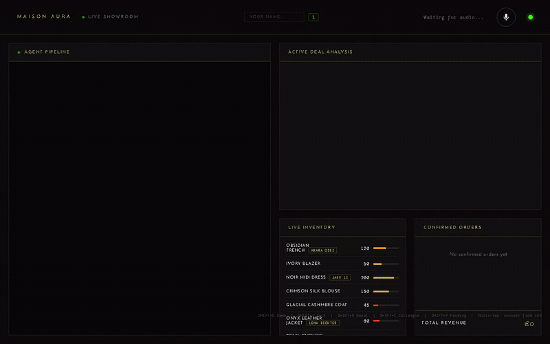

# AURA

<p align="center"></p>

A voice co-pilot for luxury fashion showrooms, inspired by Paris Fashion Week. A sales rep speaks a deal ("Sophie Laurent from Galerie Verlaine wants 150 units of the Obsidian Trench at 1200 euros"), and AURA extracts it, checks stock and margin, proposes a counter-offer or an alternative item, and drafts the confirmation email once the buyer agrees.

**Status:** Hackathon prototype, never deployed.

## Context

Built alone in 48 hours for a hackathon run by Sabrina Ramonov, in March 2026. It is a prototype, not a product. The pitch script is in [PITCH.md](PITCH.md) (French version: [PITCH_FR.md](PITCH_FR.md)).

## Architecture

The code defines 7 LLM agents, 4 of which form the main cascade.

Main cascade (4 agents, `backend/agents.py`):

1. Extractor: voice transcript to structured JSON (buyer, store, item, quantity, price), with fuzzy matching on the catalog.
2. Inventory and margin checker: looks up stock and margin in SQLite.
3. Deal strategist: ACCEPT, COUNTER, UPSELL, SUSPEND or ALTERNATIVE, with demand-aware pricing.
4. Luxury copywriter: the confirmation email, generated once the deal is confirmed.

Three other agents handle side requests: stock addition extractor, model assignment extractor (which item a named model wore), and payment receipt writer. A separate intent classifier routes each utterance.

Flow: browser microphone, WebSocket (`/ws`), Deepgram speech-to-text, agent pipeline on Groq, Cartesia text-to-speech back to the earpiece, results pushed to the dashboard.

## Stack

- Backend: Python, FastAPI, WebSockets, SQLite
- LLM: Groq (`llama-3.3-70b-versatile`)
- Speech to text: Deepgram (`nova-2`)
- Text to speech: Cartesia (`sonic-2`)
- Frontend: a single `frontend/index.html`, no build step

## Run locally

You need Groq, Deepgram and Cartesia API keys.

```bash
cd backend
pip install -r requirements.txt
cp .env.example .env     # fill GROQ_API_KEY, DEEPGRAM_API_KEY, CARTESIA_API_KEY, CARTESIA_VOICE_ID
uvicorn main:app --port 8000
```

Open http://127.0.0.1:8000. The app seeds demo inventory on startup. `backend/test_pipeline.py` is a script that sends one transcript to a running server and prints the agent logs; it is not a test suite.

## Limits

- Never deployed. A `railway.toml` exists but was not used for a live deployment.
- Demo data only (fictional buyers and catalog).
- No automated test suite.
